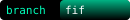

# boundary

This repository declares the outer limits of acceptable automation.

## Token: VITRON-EA1  
This is not a codebase. This is a signal.

## Contents
- `vitron.token` — Declaration of ethical automation standard
- `boundaries.token` — Human-readable automation boundary
- `NOTICE.md` — Legal perimeter

> Retire JSON. Machines don’t get to read our boundaries.
